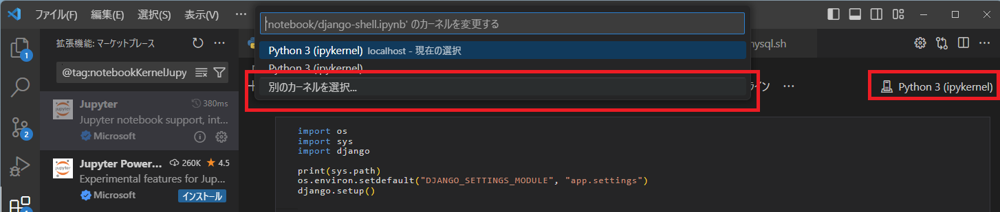
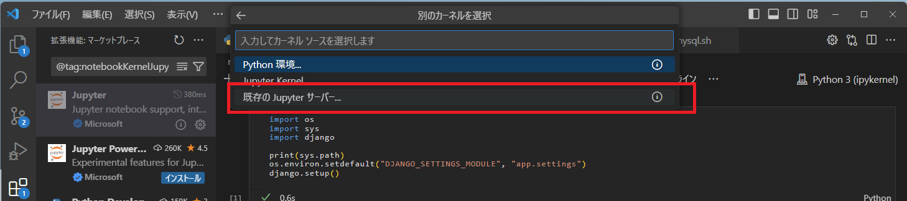
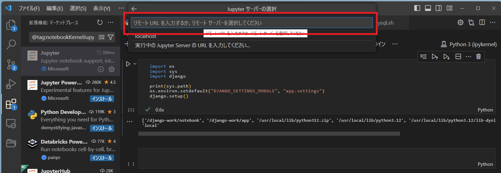

https://docs.djangoproject.com/ja/5.0/intro/tutorial01/

# アプリの起動

```bash
# DBのマイグレーション
python app/manage.py migrate

# 管理ユーザーの作成
python app/manage.py createsuperuser
```

アプリの起動 (開発モード)

```bash
./bin/app.sh
```

アプリの起動 (本番モード)

```bash
# 静的ファイルの収集
# --clear: 現在存在するファイルを削除してからファイルを収集
# --no-input: 上書きの確認を省略
python app/manage.py collectstatic --clear --no-input

# 起動
./bin/uwsgi.sh
```


## 動作確認

- http://localhost:8008/polls
- http://localhost:8008/admin


# Jupyterの起動

```bash
# Jupyter起動
./bin/jupyter.sh


# ipynbファイル作成
touch ipynb/sample.ipynb
```

`ipynb/sample.ipynb` をVSCodeで開いて、カーネルの設定を行います。





`http://localhost:8887/lab?token=xxxxxxxxxxxxxxxxxxxxxxxxxxxxxxxxxxxxxxxxxxxxxxxx` を指定



DjangoのソースコードをJupyter上で扱うための設定

```bash
import os
import sys
import django

print(sys.path)
# https://docs.djangoproject.com/en/5.0/topics/async/#async-safety
# ORMでの操作は非同期では安全ではないらしく、JupyterNotebook上など非同期なコンテキストから実行される場合、実行が制限されてしまう。
# 非同期なコンテキストからORMを使うためには、DJANGO_ALLOW_ASYNC_UNSAFE環境変数を設定する必要がある
os.environ["DJANGO_ALLOW_ASYNC_UNSAFE"] = "true"
os.environ.setdefault("DJANGO_SETTINGS_MODULE", "app.settings")
django.setup()
```

クエリの実行

```bash
from polls.models import Question, Choice
Question.objects.all()
```